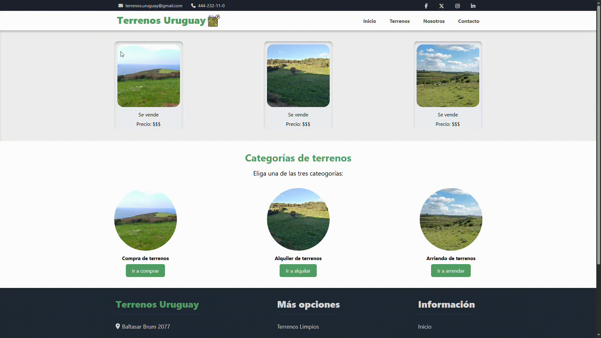

# pagina-web-html-css

## Descripción
Desarrollo de página web estática utilizando HTML5 y CSS3, aplicando estructura semántica, 
maquetación básica y estilos responsivos.

## Tecnologías utilizadas
- HTML
- CSS
- JS(Poco)

## Qué aprendí con este proyecto
- Flexbox y Grid
- Organización de archivos
- Buenas prácticas básicas

## Cómo ejecutar el proyecto
1. Descargar o clonar el repositorio.
2. Abrir el archivo `index.html` en cualquier navegador web.

## Estado del proyecto
Finalizado

## Demo

Vista rápida del proyecto web desarrollado con HTML y CSS.

